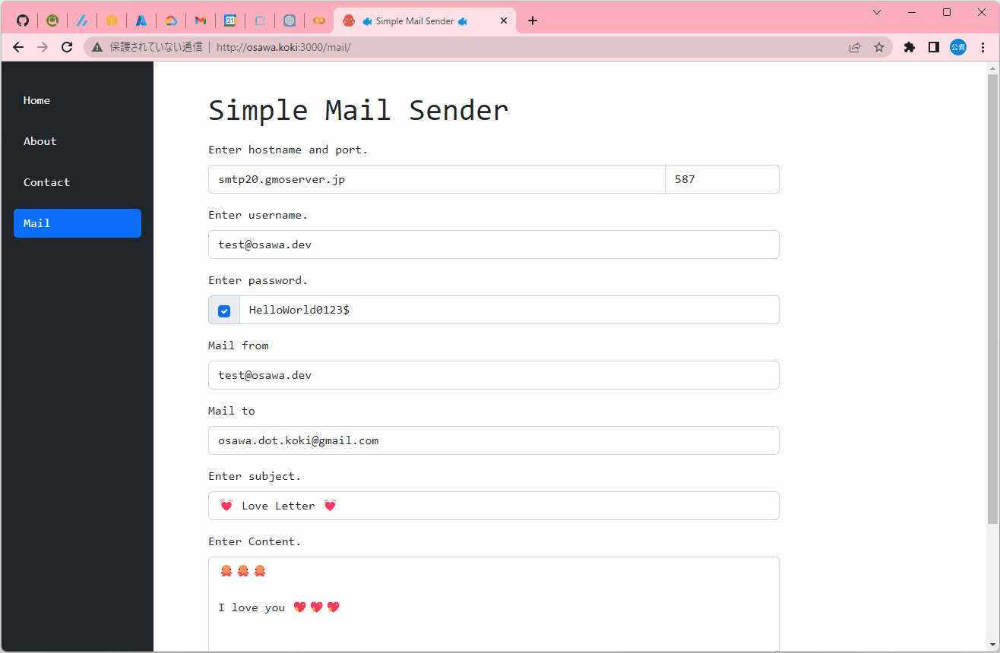

# gochi-nextjs_template

🌸🌸🌸 Go(chi)×Nextjsテンプレート。  
Docker上で動作する。  

  

## 実行方法

```shell
docker build -t gochi-nextjs-template . && docker run -p 80:80 -it --rm --name my-gochi-nextjs-template gochi-nextjs-template
```
